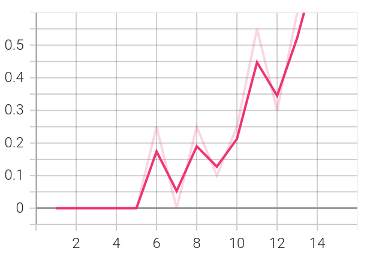

# Learning to play the Frozen Lake


## 1. Instructions

We consider the [Frozen Lake](https://gym.openai.com/envs/FrozenLake-v0/)
environment provided by [gym](https://gym.openai.com/) of
[OpenAI](https://openai.com/).
We get familiar with the environment and verify its 
observation and action space in the script:

* check_env.py

Next, we train and test various basic reinforcement learning algorithms.
Namely, we use the value iteration algorithm
to learn the V-function, a modified version of this to learn
the Q-function and the tabular Q-learning algorithm.

Each algorithm is implemented, trained and tested respectively  in the following scripts:
* v_iter.py
* q_iter.py
* tabular_q.py

The scripts can be executed independently 
and algorithms' performance can be checked in
[Tensorboard](https://www.tensorflow.org/tensorboard).
To run Tensorboard, after activating the python environment type in terminal :
```
tensorboard --logdir=runs
```
where _runs_ is the directory's name where tensorboard saved the logs.
The folder is included in the project.

Project's requirements are included in the file:
* requirements.txt
```
gym==0.19.0
numpy==1.19.5
keras==2.6.0
tensorflow==2.6.0
tensorboardX==2.4
torch==1.9.0+cpu
```

To install torch, please follow the instructions:
https://pytorch.org/get-started/locally/

For convenience, we provide the python virtual environment we use: 
* venv

The code has been written on the community version of [PyCharm](https://www.jetbrains.com/pycharm/)
and tested on 64-bit [Ubuntu](https://ubuntu.com/) 20.04.2 LTS system with
32GB memory and Intel® Core™ i7-6700HQ CPU @ 2.60GHz × 8 processor.


## 2. The RL Environment

Our environment falls into the so-called "grid world" environments,
where an agent lives in a grid of size 4 × 4 and can move in four
directions: up, down, left, and right. The agent starts at a top-left position,
and its goal is to reach
the bottom-right cell of the grid. 


There are holes in some cells of the grid and
if you get into those holes, the episode ends and your reward is zero.
If the agent reaches the goal cell,
then it obtains the reward 1.0 and the episode ends.
This environemnt is called frozen lake and  is implemented
on the console as: 

```
SFFF       (S: starting cell, safe)
FHFH       (F: frozen surface, safe)
FFFH       (H: hole, episode ends unsuccesfully)
HFFG       (G: goal)
```

Additionally, the movement direction of the agent is
uncertain and only partially depends on the chosen direction.
The agent's actions do not always turn out as expected:
there is a 33% chance
that it will slip to the right or to the left. 
We want the agent to move left, for
example, but there is a 33% probability that it will indeed move left, a 33%
chance that it will end up in the cell above, and a 33% chance that it will end up
in the cell below. 

## 3. Results

### Value Iteration for learning the V-function
In the chart below, we can see the convergence of rewards.


### Value Iteration for learning the Q-function

In the chart below, we can see the convergence of rewards.


### Tabular Q-learning
In the chart below, we can see the convergence of rewards of the tabular
Q-learning algorithm.


## 4. Bibliography

* https://spinningup.openai.com

* https://gym.openai.com/envs/FrozenLake-v0/

* https://reinforcement-learning4.fun/2019/06/09/introduction-reinforcement-learning-frozen-lake-example/

* Sutton R., Barto A., Reinforcement Learning: An Introduction, MIT Press 2018.
* Mitchell T., Machine Learning, McGraw Hill, 1997. 
* Ciaburro G., Keras Reinforcement Learning Projects, Packt 2018.
* Lapan M., Deep Reinforcement Learning hands on, Packt 2018.


